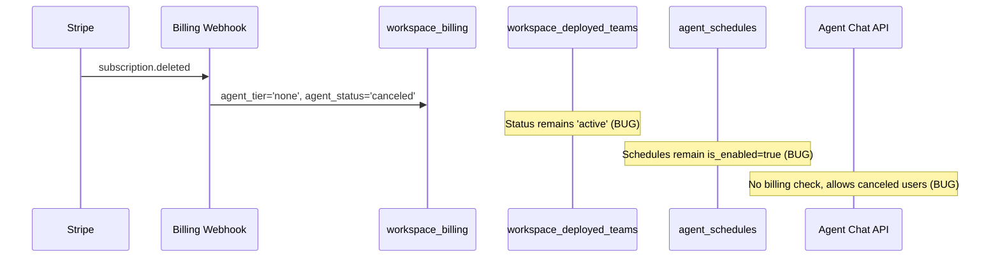
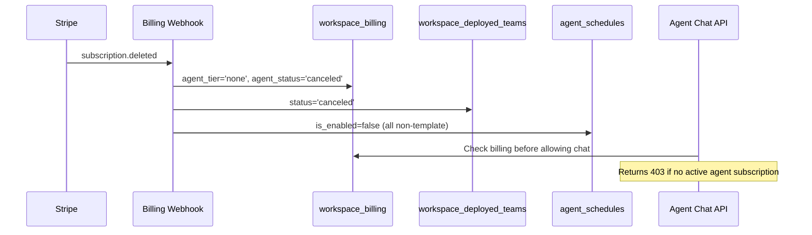

# Billing-Schedule Integrity Specification

## Problem Statement

When billing state changes (subscription canceled, tier downgraded, etc.), downstream state (deployments, schedules, chat access) is not updated, leaving the system in inconsistent states.

## Current Behavior

## Desired Behavior

## Gaps Addressed

### Gap 1: Cancellation doesn't mark deployment as canceled
- **Symptom**: `workspace_deployed_teams.status` stays `'active'` after cancellation
- **Fix**: Add `'canceled'` to status CHECK constraint; update deployment on cancel

### Gap 2: Agent chat has no billing gate
- **Symptom**: Users with canceled subscriptions can still chat with agents
- **Fix**: Server-side billing check in `/api/agent-chat`; client-side gate on chat page

### Gap 3: Cancellation doesn't disable schedules
- **Symptom**: `agent_schedules.is_enabled` stays `true` after cancellation
- **Fix**: Disable all non-template schedules on cancel

### Gap 4: Pending tier application is not atomic
- **Symptom**: Race condition between cron job and webhook applying pending tier
- **Fix**: Atomic CAS (Compare-And-Swap) pattern using conditional UPDATE

### Gap 5: Deployment failures are silently lost
- **Symptom**: Fire-and-forget deploy calls lose errors
- **Fix**: Track `agent_deploy_status` in workspace_billing; create billing alerts on failure

### Gap 6: Schedule cloning is duplicated
- **Symptom**: `hire/route.ts` has its own `cloneScheduleTemplates` diverging from `schedule-templates.ts`
- **Fix**: Unify on shared function; add proper `next_run_at` with `cron-parser`

## Edge Cases

1. **Double cancellation**: Webhook fires twice — second call should be idempotent (no active deployment to cancel)
2. **Cancellation during pending downgrade**: Pending tier should be cleared (already done in `handleSubscriptionCanceled`)
3. **Re-subscription after cancellation**: New deploy creates fresh deployment; old `'canceled'` deployment stays as history
4. **Deploy failure on cancellation cleanup**: Deployment cancel and schedule disable should each proceed independently
5. **CAS race condition**: Two concurrent `applyPendingTierChange` calls — exactly one should win, other returns `applied: false`

## Files to Modify

| File | Change |
|------|--------|
| `apps/admin/supabase/migrations/118_billing_schedule_integrity.sql` | Schema changes + data remediation |
| `apps/user-web/src/lib/billing-queries.ts` | Cancel cleanup, deploy tracking |
| `apps/user-web/src/app/agents/(chat)/layout.tsx` | Add BillingProvider |
| `apps/user-web/src/app/agents/(chat)/[id]/page.tsx` | Billing gate UI |
| `apps/user-web/src/app/api/agent-chat/route.ts` | Server-side billing check |
| `packages/database/src/apply-pending-tier.ts` | Atomic CAS function |
| `packages/database/src/index.ts` | Export new functions |
| `apps/admin/src/app/api/cron/apply-pending-agent-downgrades/route.ts` | Use CAS + retry |
| `apps/user-web/src/app/api/billing/webhook/route.ts` | Use CAS, deploy tracking |
| `packages/database/package.json` | Add cron-parser |
| `packages/database/src/schedule-templates.ts` | Add getNextCronRunTime, fix next_run_at |
| `apps/user-web/src/app/api/agents/[id]/hire/route.ts` | Remove local clone, use shared |

## Verification Plan

1. Type-check passes: `pnpm type-check`
2. `handleSubscriptionCanceled('agent_tier')` → deployment gets `'canceled'`, schedules get `is_enabled=false`
3. POST `/api/agent-chat` with canceled workspace → 403
4. Chat page shows billing overlay when `canAccessFeature('agents')` is false
5. Two concurrent `applyPendingTierChange()` calls → exactly one succeeds
6. Deploy failure → `agent_deploy_status='failed'` + billing alert created
7. Hire route uses shared `cloneScheduleTemplatesForDeployment` from `@dreamteam/database`
