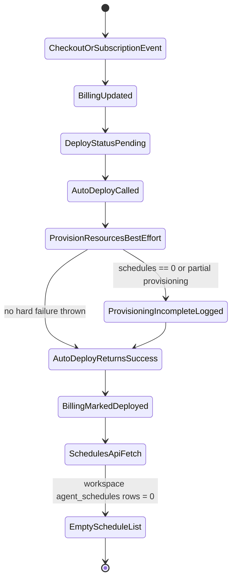
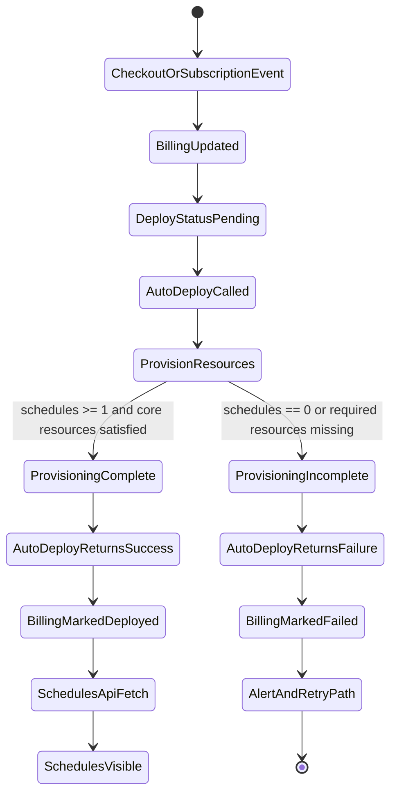

# Fix Missing Deployed Schedules On Plan Purchase

## Scope

Users can complete an agent-tier purchase and still see no schedules in the Agents UI.  
This spec covers the plan-purchase-to-schedule-visibility pipeline and defines how deployment success should be determined.

## Current Behavior

### State Diagram (Current)

### Current Behavior Details

1. Billing webhook / subscription flows set `agent_deploy_status='pending'`, call `autoDeployTeamForPlan`, and mark `'deployed'` when `deployResult.deployed` is true.
2. `autoDeployTeamForPlan` always returns `deployed: true` once deployment record creation and `provisionDeploymentResources(...)` call complete without a thrown error.
3. `provisionDeploymentResources` treats provisioning as best-effort:
  - it detects incomplete provisioning (`counts.schedules === 0`, profile/channel shortfall),
  - logs an audit entry,
  - but still returns normally.
4. `cloneScheduleTemplatesForDeployment` also logs-and-returns on template fetch/clone failures.
5. Result: billing can be marked deployed even when no non-template schedules exist for the workspace.
6. UI schedule list (`/api/agents/schedules`) correctly filters by `workspace_id`; therefore it returns an empty list when cloning failed or templates were missing.

## Desired Behavior

### State Diagram (Desired)

### Desired Behavior Details

1. Deployment result must encode provisioning completeness, not only exception/no-exception.
2. `autoDeployTeamForPlan` must return `deployed: false` when schedule provisioning is incomplete (especially `schedules === 0` for enabled agents).
3. Existing callers (webhook, direct subscription creation/update, pending-tier apply, cron retry) should continue using `deployResult.deployed` but now receive accurate failure semantics.
4. Billing should remain `'failed'` (not `'deployed'`) until a successful deploy includes schedule availability.
5. Retry paths remain enabled via existing failed-deploy cron/alert logic.

## Edge Cases

1. Agent-tier checkout completes but Stripe subscription status is not `active` yet (`incomplete`, `past_due`): do not force deploy; preserve pending behavior.
2. Upgrade path (`customer.subscription.updated`) from lower tier to higher tier while active: deploy must fail if schedule cloning is incomplete.
3. Pending downgrade application (`applyPendingTierChange`) with CAS race protection: only one updater should apply; deploy result must still reflect schedule completeness.
4. Plan has no linked `team_id` (`plans.team_id IS NULL`): deployment fails before provisioning.
5. Team has no enabled agents in config: treat as no-op deployment state explicitly (avoid false positive success if schedules are expected elsewhere).
6. Schedule templates missing for one or more enabled agents: deployment should be incomplete/fail, not silently deployed.
7. Unique index missing / duplicate rows in `agent_schedules` causing upsert fallback behavior: fallback may still produce partial clones; incomplete deploy should surface failure.
8. Existing deployment for same team (`autoDeployTeamForPlan` early-return path): must still enforce provisioning completeness before returning success.
9. Guest checkout + complete-signup flow: post-signup deploy must also use completeness-aware success.
10. Cross-workspace isolation: API filtering by `workspace_id` must continue to show truly empty state for missing clones; no data leakage from other workspaces.
11. Partial resource provisioning (profiles/channels created, schedules absent): should be a hard deployment failure for billing status.
12. Retry exhaustion (`MAX_DEPLOY_RETRIES`) in admin cron: failed state should remain observable and actionable.

## Files To Modify And Why

| File | Why |
|---|---|
| `packages/database/src/deployment-resources.ts` | Add explicit completeness contract in return value (or error mode) so callers can distinguish incomplete provisioning from true success. |
| `packages/database/src/auto-deploy.ts` | Consume provisioning completeness and return `deployed: false` when schedule provisioning is incomplete in both new-deploy and same-team paths. |
| `packages/database/src/schedule-templates.ts` | Optionally return clone metrics/error metadata (instead of pure log-and-return) to support deterministic deploy outcome decisions. |
| `packages/database/src/__tests__/auto-deploy.test.ts` | Add regression tests proving deploy returns false when provisioning reports zero schedules. |
| `packages/database/src/__tests__/schedule-templates.test.ts` | Add/adjust tests for incomplete clone scenarios and propagated outcome signaling. |
| `apps/user-web/src/app/api/billing/webhook/route.ts` | Verify no logic changes needed beyond consuming accurate `deployResult`; add tests or assertions if present for deployed/failed status transitions. |
| `apps/user-web/src/lib/billing-queries.ts` | Same as webhook path for direct card-on-file subscription flows; confirm failed deploy status is set when deploy result is incomplete. |

## Verification Plan

1. Reproduce failing scenario in test by mocking provisioning summary with `schedules: 0`; assert `autoDeployTeamForPlan(...).deployed === false`.
2. Validate webhook path keeps `workspace_billing.agent_deploy_status='failed'` when deploy incomplete.
3. Validate direct subscription creation/update path (`createAgentTierSubscription`, `updateAgentTierSubscription`) marks failed deploy on incomplete provisioning.
4. Validate successful path still sets `'deployed'` and schedules are visible via `/api/agents/schedules?workspaceId=...`.
5. Validate cron retry can recover previously failed deploys once provisioning becomes complete.
