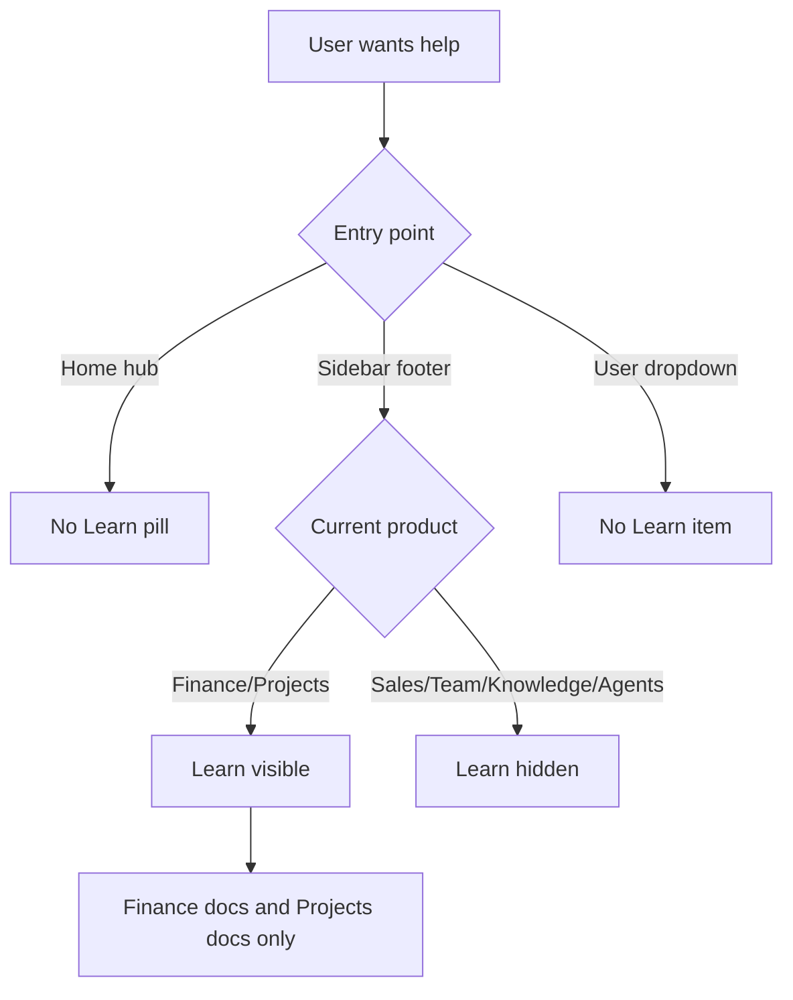
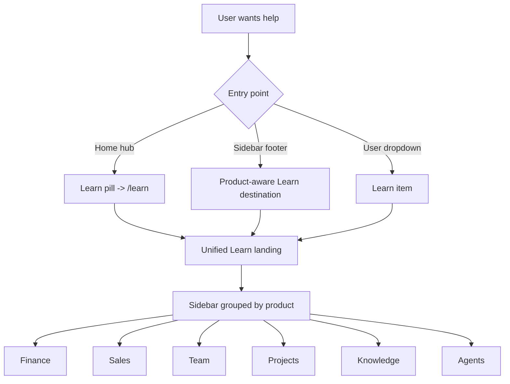

# Unified Learn Center Across All Products

## Summary
Create a single Learn experience that covers all products (`finance`, `sales`, `team`, `projects`, `knowledge`, `agents`) and make Learn discoverable from the home hub, the left sidebar user dropdown, and the app sidebar footer.

## Current Behavior
- Learn exists, but coverage is inconsistent:
  - Finance docs live at `/learn/*`.
  - Projects docs live at `/learn/projects/*`.
  - Sales/Team/Knowledge/Agents Learn sections do not exist.
- Sidebar Learn footer button is only shown for Finance and Projects.
- User menu in left sidebar has Settings/Support/Logout, but no Learn entry.
- Home hub bottom quick links include Support/Download only.
- Product switchers only special-case `/learn/projects`; other future `/learn/{product}` routes would be misclassified.

## Desired Behavior
- Learn is reachable from:
  - Home hub quick-link pill.
  - Left-sidebar user dropdown (while keeping Settings).
  - App sidebar footer for every product.
- Learn has a unified information architecture with grouped sections by product.
- Existing deep links remain valid:
  - `/learn/*` finance docs
  - `/learn/projects/*` projects docs
- New starter coverage exists for:
  - `/learn/sales/*`
  - `/learn/team/*`
  - `/learn/knowledge/*`
  - `/learn/agents/*`
- Product/workspace switchers correctly classify learn routes by product context.

## Scope
### In Scope
- Shared Learn catalog/types + helper.
- Learn sidebar rebuild with grouped sections.
- New product Learn hubs and starter guides for missing products.
- Home/user-menu/sidebar Learn entry points.
- Product detection updates for `/learn/{product}` paths.

### Out of Scope
- Backend APIs or DB schema changes.
- Rewriting existing finance/projects deep tutorial content.
- Video hosting or CMS-backed content.

## Files to Modify
1. `docs/specs/unified-learn-center.md`
2. `apps/user-web/src/components/learn/learn-catalog.ts` (new)
3. `apps/user-web/src/components/learn/learn-sidebar.tsx`
4. `apps/user-web/src/components/learn/index.ts`
5. `apps/user-web/src/app/learn/page.tsx`
6. `apps/user-web/src/app/learn/layout.tsx`
7. `apps/user-web/src/app/learn/sales/page.tsx` (new)
8. `apps/user-web/src/app/learn/sales/getting-started/page.tsx` (new)
9. `apps/user-web/src/app/learn/sales/core-workflows/page.tsx` (new)
10. `apps/user-web/src/app/learn/team/page.tsx` (new)
11. `apps/user-web/src/app/learn/team/getting-started/page.tsx` (new)
12. `apps/user-web/src/app/learn/team/core-workflows/page.tsx` (new)
13. `apps/user-web/src/app/learn/knowledge/page.tsx` (new)
14. `apps/user-web/src/app/learn/knowledge/getting-started/page.tsx` (new)
15. `apps/user-web/src/app/learn/knowledge/core-workflows/page.tsx` (new)
16. `apps/user-web/src/app/learn/agents/page.tsx` (new)
17. `apps/user-web/src/app/learn/agents/getting-started/page.tsx` (new)
18. `apps/user-web/src/app/learn/agents/core-workflows/page.tsx` (new)
19. `apps/user-web/src/components/home/home-hub.tsx`
20. `apps/user-web/src/components/app-sidebar.tsx`
21. `apps/user-web/src/components/nav-user.tsx`
22. `apps/user-web/src/components/product-switcher.tsx`
23. `apps/user-web/src/components/workspace-switcher.tsx`

## Edge Cases
- Existing finance links under `/learn/*` must continue working.
- Existing project links under `/learn/projects/*` must continue working.
- Learn footer button must render consistently even for products with no data loaded yet.
- Product detection must not misclassify `/learn` root (default to finance behavior).
- Learn routes must remain accessible regardless of workspace product access metadata (content route, not product feature gate).
- User dropdown Learn must coexist with existing Settings behavior.

## Verification Plan
1. Navigation visibility checks:
   - Home hub shows Learn quick-link pill.
   - Sidebar footer shows Learn for all products.
   - User dropdown includes Learn and Settings.
2. Routing checks:
   - `/learn/sales`, `/learn/team`, `/learn/knowledge`, `/learn/agents` render.
   - Existing `/learn/accounts` and `/learn/projects/tasks` still render.
3. Sidebar checks:
   - Learn sidebar shows grouped product sections.
   - Active state highlights correct item across old/new routes.
4. Product context checks:
   - Product switcher/workspace switcher resolve correct product for `/learn/{product}` routes.
5. Regression checks:
   - No API surface changes.
   - Existing primary product navigation remains unchanged.
